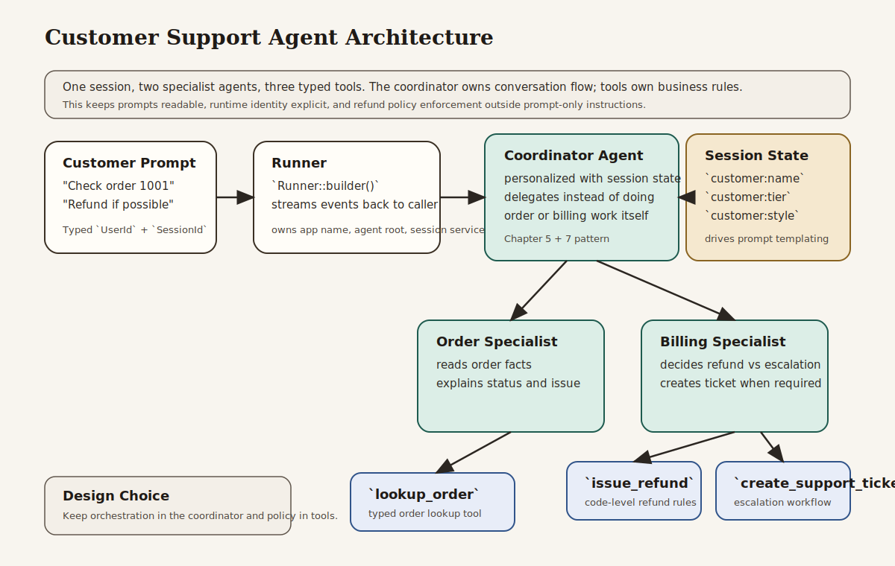

# Customer Support Agent

Beginner-friendly customer support agent that combines the main ADK-Rust lessons from the book into one runnable project.

## What This Example Teaches

- Chapter 3 concepts: explicit model, session, runner, content, and streamed responses
- Chapter 5 concepts: session-backed personalization and multi-turn continuity
- Chapter 6 concepts: typed tools for exact operations instead of free-form guessing
- Chapter 7 concepts: specialist delegation through agent-as-tool patterns
- Chapter 16 habits: clear boundaries around refunds, escalation, and support actions

## Architecture



### System Overview: How it Works

- The **runner** is the execution boundary. It owns the app name, root agent, session service, and the streamed response lifecycle.
- The **coordinator agent** owns conversation flow. It decides which specialist should handle the next step and returns one final customer-facing answer.
- The **specialist agents** own narrower domains. The order specialist reads order facts; the billing specialist handles refunds and escalation.
- The **typed tools** own concrete business actions. They return structured data and enforce the operational rules the LLM must respect.
- The **session service** stores both seeded state and event history, so the same session can support personalization and multi-turn continuity.

### Design Choices

- **Coordinator plus specialists instead of one large agent**
  This keeps prompts smaller and responsibilities clearer. A single large support agent can work for a demo, but it quickly becomes harder to reason about when order lookup, refund policy, and escalation logic all compete in one prompt.

- **Typed tools instead of free-form tool inputs**
  The tool argument structs make the operational contract explicit. That improves reliability and gives beginners a direct line from Rust types to agent behavior.

- **Policy enforcement in code, not only in instructions**
  The refund limit is enforced in `issue_refund`, not just described in a prompt. That is the right production habit: prompts guide behavior, but code owns rules.

- **Session-backed personalization instead of hardcoded prompts**
  Customer metadata is stored once in session state and then injected into the coordinator prompt. This scales better than building a separate agent prompt for every user.

- **One root coordinator returned to the runner**
  The runner only needs one root agent. Delegation happens inside that agent graph through `AgentTool`, which keeps the outer runtime boundary simple.

### Request Flow

1. The caller sends a customer message with a typed `UserId` and `SessionId`.
2. The runner loads the session and invokes the coordinator.
3. The coordinator reads personalized context from session state.
4. The coordinator delegates to the order specialist or billing specialist as needed.
5. Specialists call typed tools to perform lookup, refund, or escalation work.
6. Tool results come back as structured data.
7. The coordinator turns those results into one clear response and the runner streams it back.

### Why This Architecture Fits The Book

- It shows the Chapter 3 runtime model directly instead of hiding it behind helpers.
- It applies the Chapter 5 distinction between state and history in a real workflow.
- It demonstrates the Chapter 6 rule that tools should perform exact actions with typed contracts.
- It uses the Chapter 7 delegation model to keep a multi-step workflow understandable.
- It reinforces the Chapter 16 idea that operational boundaries should be enforced in code-level components.

## How to Read the Code

If you are using this project as a study example, read it in this order:

1. `src/main.rs`: the typed tool inputs and tool functions
2. `src/main.rs`: `create_session`, which seeds per-customer state
3. `src/main.rs`: the specialist agents, which each own one job
4. `src/main.rs`: the coordinator agent, which delegates instead of doing every task itself
5. `src/main.rs`: `build_runner` and `print_turn`, which show the runtime boundary and streamed execution

That order matches the book's progression from basic runner setup to session state, tools, delegation, and production boundaries.

## What the Agent Does

The example simulates a small support team:

- an order specialist checks order details with a typed tool
- a billing specialist decides whether a refund can be approved immediately
- the same billing specialist creates a support ticket when manager approval is required
- a coordinator agent delegates to the right specialist and gives the customer one clear answer

The runtime also seeds session state with customer metadata so the coordinator can personalize replies without hardcoding a different prompt for every user.

## Why This Project Is Useful

This is the kind of example that helps a new reader move from isolated chapter exercises to a realistic application shape. It is still small enough to read in one sitting, but it shows how the pieces from the book fit together:

- typed runtime identity
- session-backed instructions
- tool-backed business actions
- specialist delegation
- multi-turn execution in one session

## Run It

```bash
cargo run -p customer-support-agent
```

You will need:

- `GOOGLE_API_KEY` in your environment or `.env`

The program runs two support turns in one session:

1. a damaged order with an immediate refund
2. a higher-value order that requires escalation and ticket creation

## What to Notice

- The tools return structured data; the agents narrate the result.
- The coordinator does not do billing or order lookup directly; it delegates.
- Session state is used for personalization, while session history is used for continuity.
- Refund rules are enforced through code-level tools rather than prompt-only instructions.
- The example is intentionally explicit. It does not hide the model, session, or runner behind helper wrappers, because those are the core runtime concepts the book is teaching.
