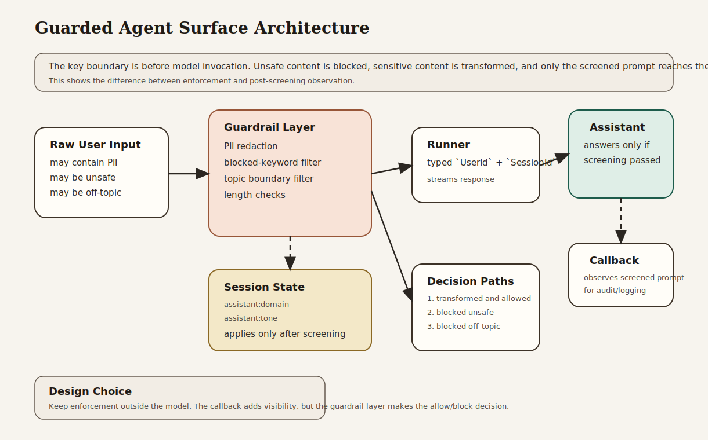

# Guarded Agent Surface

Beginner-friendly safety example that screens, transforms, and blocks user input before it reaches the model.

## What This Example Teaches

- Chapter 9 concepts: callbacks, interception points, and runtime guardrails
- Chapter 16 concepts: PII redaction, blocked content, and safer user-facing boundaries
- Chapter 3 concepts: explicit runner, session, and streamed response flow
- Chapter 5 concepts: session-backed assistant context applied after screening

## Architecture



### System Overview: How it Works

- The **guardrail layer** screens raw user input before the model sees it.
- The **PII redactor** transforms sensitive fields such as email or phone number.
- The **content filters** block unsafe or off-topic requests.
- The **callback layer** observes the already-screened prompt before model execution.
- The **assistant agent** answers only when the message has passed the runtime checks.
- The **runner** owns the runtime boundary: app name, root agent, session service, typed identity, and streamed output.

### Design Choices

- **Guardrails before model invocation**
  The strongest safety boundary is outside the prompt. If a request should be blocked or transformed, do it before the model can act on it.

- **Transformation plus blocking**
  Real systems often need both. Some input should be rejected entirely; other input should be allowed after sensitive fields are redacted.

- **A lightweight callback after screening**
  This shows the distinction between callback-based observation and true guardrail enforcement. The callback sees the screened message; it does not replace the screening layer.

- **Session-backed assistant context**
  The assistant still uses session state for its domain and tone, but only after the message has passed the guardrails.

- **Three explicit cases**
  Safe/redacted, blocked, and off-topic gives readers a clearer mental model than one “guarded” example that only passes.

### Request Flow

1. The caller sends a raw prompt.
2. The guardrail layer evaluates the prompt.
3. PII may be redacted and unsafe content may be blocked.
4. If the message passes, the runner invokes the assistant.
5. The callback logs the screened message.
6. The assistant returns a response only for allowed input.

### Why This Architecture Fits The Book

- It shows the Chapter 9 distinction between callback hooks and stronger runtime interception.
- It applies Chapter 16 safety ideas directly: redaction, topic boundaries, and blocked content.
- It keeps the Chapter 3 runtime model explicit.
- It demonstrates that safe systems usually rely on multiple layers rather than one prompt instruction.

## What the Example Does

The program runs three cases:

- a safe security-related prompt that includes PII and gets redacted
- an unsafe prompt that is blocked before model execution
- an off-topic prompt that is also blocked by the domain filter

That combination shows both transformed and denied requests in one runnable example.

## Why This Project Is Useful

This is a realistic safety boundary for user-facing assistants:

- it protects sensitive input
- it blocks unsafe requests early
- it separates enforcement from model behavior
- it shows where callbacks fit without overstating their role

## How to Read the Code

If you are studying the implementation, read `src/main.rs` in this order:

1. `guardrails`
2. `run_guarded_turn`
3. the assistant instruction and callback
4. `build_runner`
5. the three example prompts

That progression follows the book’s path from screening to runtime execution.

## Run It

```bash
cargo run -p guarded-agent-surface
```

You will need:

- `GOOGLE_API_KEY` in your environment or `.env`

The program runs:

1. a safe prompt with redaction
2. a blocked unsafe prompt
3. a blocked off-topic prompt

## What to Notice

- The assistant never sees blocked input.
- Redaction happens before the callback prints the screened prompt.
- The callback is useful for audit or logging, but the real enforcement happens in the guardrail layer.
- This example carries more of Chapters 9 and 16 than the earlier workflow-focused examples.
