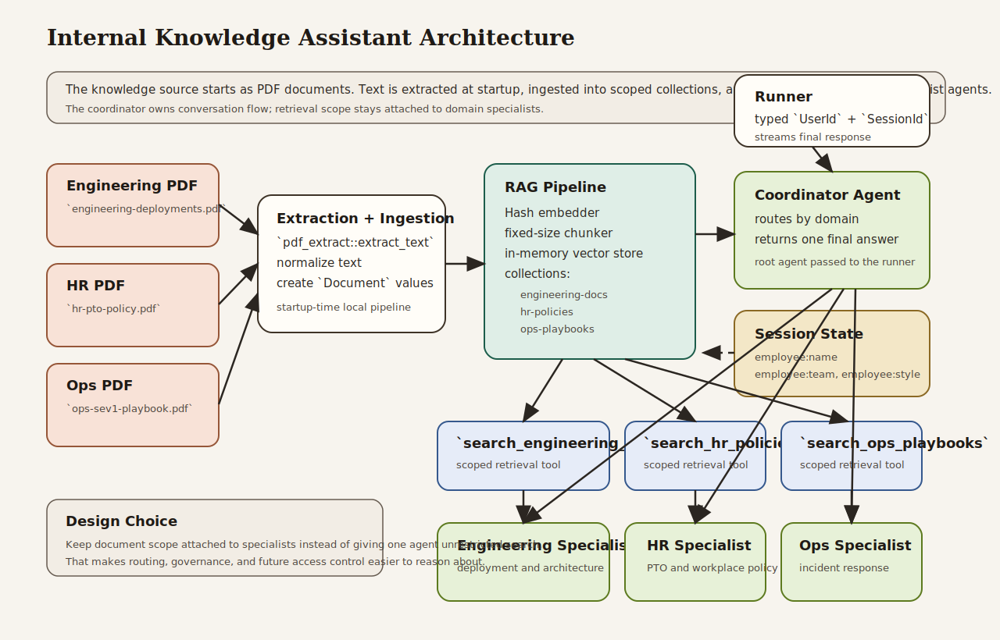

# Internal Knowledge Assistant

Beginner-friendly internal knowledge assistant that answers company questions over scoped PDF document collections instead of one unbounded knowledge source.

## What This Example Teaches

- Chapter 3 concepts: explicit model, session, runner, content, and streamed responses
- Chapter 5 concepts: session-backed personalization and multi-turn continuity
- Chapter 6 concepts: typed retrieval tools with narrow operational boundaries
- Chapter 7 concepts: coordinator plus specialist delegation through `AgentTool`
- Chapter 10 concepts: local RAG ingestion, chunking, embeddings, and retrieval
- Chapter 16 habits: scope control so engineering, HR, and ops knowledge stay separated

## Real-World Shift

This example now ingests real PDF fixtures from `assets/policies/` before building the assistant. That is closer to how internal knowledge systems work in practice: the knowledge base starts as documents, not inline strings inside the application.

The example still keeps the pipeline local and simple:

- PDFs are extracted at startup
- extracted text is ingested into scoped collections
- specialists retrieve only from their assigned collection

In production, teams usually extend this with OCR, document versioning, background ingestion jobs, metadata indexing, and access control per collection.

## Architecture



### System Overview: How it Works

- The **PDF fixtures** are the source of truth for policy content in this example.
- The **extraction and ingestion step** reads those PDFs at startup, normalizes the text, and creates `Document` values for the RAG pipeline.
- The **RAG pipeline** owns chunking, embeddings, and vector search across three named collections.
- The **typed retrieval tools** expose one collection each instead of one global search surface.
- The **specialist agents** answer only within their own domain.
- The **coordinator agent** owns routing and returns a single final answer to the employee.
- The **runner** owns the runtime boundary: app name, root agent, session service, typed user/session identity, and streamed output.

### Design Choices

- **PDF-backed ingestion instead of inline policy strings**
  This keeps the example closer to how internal assistants work in practice. The knowledge base starts as documents, not code literals.

- **Scoped collections instead of one shared knowledge pool**
  Engineering, HR, and operations documents stay separated. That makes routing more explicit and reduces accidental cross-domain retrieval.

- **One retrieval tool per collection**
  A narrow tool contract makes the retrieval boundary visible in code. It also gives a cleaner path to future access control than a single unrestricted search tool.

- **Coordinator plus specialists instead of one large RAG agent**
  The coordinator handles conversation flow. Specialists handle domain retrieval. That keeps the prompt surface smaller and the architecture easier to extend.

- **Startup extraction instead of background ingestion infrastructure**
  For a companion example, startup ingestion is the right tradeoff. It keeps the project runnable in one command while still demonstrating a real document path.

### Request Flow

1. The application loads PDF documents from `assets/policies/`.
2. Text is extracted and ingested into scoped RAG collections.
3. The caller sends a question with a typed `UserId` and `SessionId`.
4. The runner invokes the coordinator agent.
5. The coordinator delegates to the correct specialist.
6. The specialist calls its scoped retrieval tool.
7. Retrieved text comes back from the relevant collection.
8. The coordinator returns one final employee-facing answer.

### Why This Architecture Fits The Book

- It shows the Chapter 3 runtime model directly through the explicit runner boundary.
- It applies the Chapter 5 session-state model to personalize responses.
- It uses Chapter 6 typed tools to make retrieval scope explicit.
- It uses the Chapter 7 delegation pattern to keep a multi-domain workflow understandable.
- It turns the Chapter 10 RAG material into a more realistic document-backed system.
- It reinforces the Chapter 16 principle that operational boundaries should be visible in code, not only implied by prompts.

## What the Assistant Does

The example builds a small internal assistant with three PDF-backed knowledge domains:

- `engineering-docs` for deployment rules
- `hr-policies` for PTO policy answers
- `ops-playbooks` for incident response procedures

The coordinator does not search all collections directly. Instead, it delegates to a specialist for the relevant domain, and each specialist can only search its own collection.

## Why This Architecture Matters

This is a realistic step up from a single retrieval demo:

- the retrieval boundary is explicit
- prompts stay smaller and easier to reason about
- company policy domains do not silently bleed into each other
- a reader can see how RAG and agent delegation fit together in one application

## How to Read the Code

If you are studying the implementation, read `src/main.rs` in this order:

1. `HashEmbedder`, `PDF_SOURCES`, and `create_pipeline`
2. the typed retrieval tools
3. `create_session`
4. the three specialist agents
5. the coordinator agent
6. `build_runner` and `print_turn`

That progression follows the book: retrieval setup first, then tools, then agent composition, then runtime execution.

## Run It

```bash
cargo run -p internal-knowledge-assistant
```

You will need:

- `GOOGLE_API_KEY` in your environment or `.env`

The program runs three turns in the same session:

1. an engineering deployment question
2. an HR PTO question
3. an operations incident-response question

## What to Notice

- The collections are separate by design. Retrieval scope is part of the system design, not just a prompt suggestion.
- The specialists own domain retrieval. The coordinator owns conversation flow.
- Session state personalizes the final response style without rebuilding the agent each time.
- The example uses a local in-memory vector store and simple embedder so the reader can focus on ADK-Rust concepts first.
- The source documents are actual PDFs, which makes the retrieval flow more realistic even though the ingestion pipeline is still small.
