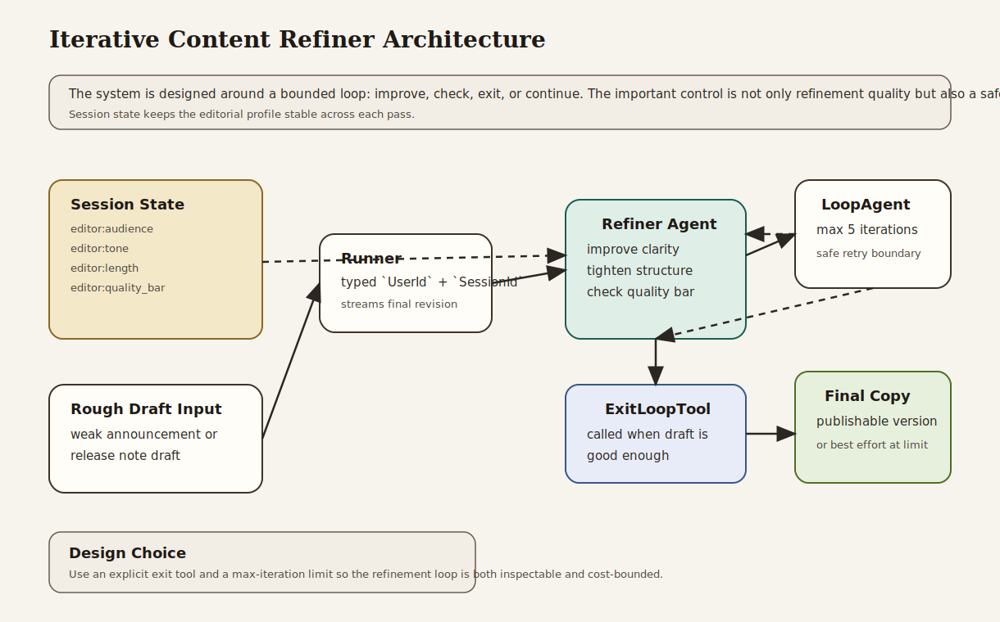

# Iterative Content Refiner

Beginner-friendly loop workflow example that improves rough copy until it meets a quality bar or reaches a safe iteration limit.

## What This Example Teaches

- Chapter 3 concepts: explicit model, session, runner, content, and streamed responses
- Chapter 5 concepts: session-backed editorial preferences and follow-up continuity
- Chapter 7 concepts: bounded refinement loops with explicit exit conditions
- Chapter 16 habit: treating stopping rules as part of the system design, not as an accidental side effect

## Architecture



### System Overview: How it Works

- The **session service** stores editorial preferences such as audience, tone, length, and quality bar.
- The **refiner agent** improves the content one pass at a time.
- The **`ExitLoopTool`** lets the agent end the loop once the draft is good enough.
- The **`LoopAgent`** enforces a maximum iteration count so refinement cannot continue forever.
- The **runner** owns the runtime boundary: app name, root agent, session service, typed identity, and streamed output.

### Design Choices

- **Loop workflow instead of one-shot rewriting**
  Some content is easier to improve incrementally than to perfect in one prompt. The loop makes that process explicit.

- **Exit tool instead of implicit stopping**
  The loop ends when the agent decides the quality bar has been met, and that decision is made visible through a concrete workflow mechanism.

- **Session-backed editorial profile**
  Tone, audience, and quality expectations live in session state, so the same loop can be reused for multiple editing tasks.

- **Bounded iterations**
  Production systems need a ceiling. A loop without a maximum iteration count can create runaway costs or unstable behavior.

- **No separate critic agent in the first version**
  This example stays focused on the basic loop pattern. A two-agent critique/refine pattern can come later if needed.

### Request Flow

1. The application creates a session with editorial preferences.
2. The caller submits a rough draft.
3. The runner invokes the root `LoopAgent`.
4. The refiner improves the draft.
5. If the quality bar is met, the refiner calls `ExitLoopTool`.
6. Otherwise, the loop continues until the draft improves or the max iteration limit is reached.

### Why This Architecture Fits The Book

- It shows the Chapter 3 runtime model directly.
- It uses Chapter 5 session state to carry editorial preferences across refinement tasks.
- It demonstrates the Chapter 7 principle that loops are useful when improvement must be iterative but bounded.
- It reinforces the Chapter 16 idea that retry and stopping policies are part of the runtime contract.

## What the Refiner Does

The example runs two editing tasks:

- a rough customer-facing product update
- a rough release note about role-based access controls

Both are refined under the same editorial profile, which keeps the workflow reusable while still showing continuity across turns.

## Why This Project Is Useful

This is a realistic quality-improvement workflow for product and communications teams:

- it turns weak drafts into clearer customer-facing copy
- it makes the stopping condition explicit
- it demonstrates how to avoid unbounded refinement
- it gives readers a concrete use case for `LoopAgent`

## How to Read the Code

If you are studying the implementation, read `src/main.rs` in this order:

1. `create_session`
2. the refiner instruction
3. the `LoopAgent` construction
4. `build_runner`
5. the two example refinement prompts

That progression follows the book’s path from state to bounded iteration.

## Run It

```bash
cargo run -p iterative-content-refiner
```

You will need:

- `GOOGLE_API_KEY` in your environment or `.env`

The program runs:

1. a product update refinement
2. a follow-up release note refinement in the same session

## What to Notice

- The loop has a real exit path and a real safety limit.
- Session state keeps the tone and audience stable across both tasks.
- This is a refinement workflow, not a retrieval or tool-integration example.
- The main lesson is that quality improvement can be iterative without becoming open-ended.
