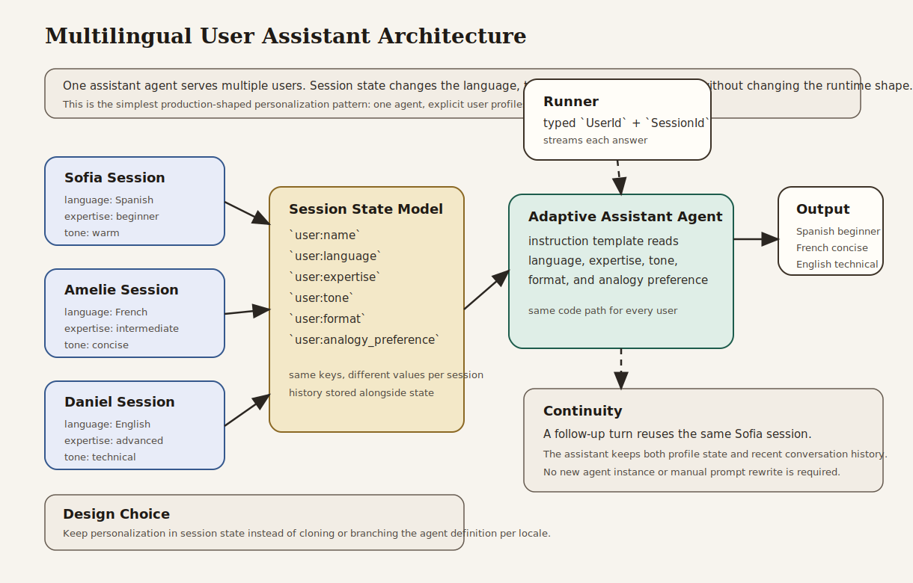

# Multilingual User Assistant

Beginner-friendly multilingual assistant that adapts its language, tone, and explanation depth from session-backed user preferences.

## What This Example Teaches

- Chapter 3 concepts: explicit model, session, runner, content, and streamed responses
- Chapter 5 concepts: session-backed personalization and multi-turn continuity
- Chapter 6 habit: keeping the first adaptive assistant simple instead of introducing tools too early
- Chapter 16 habit: preserving clear runtime boundaries around user identity and profile state

## Architecture



### System Overview: How it Works

- The **session service** stores one profile per user session.
- The **profile state** contains language, expertise, tone, response format, and analogy preference.
- The **assistant agent** reads those fields through template placeholders in its instruction.
- The **runner** owns the runtime boundary: app name, root agent, session service, typed identity, and streamed responses.
- The **same agent implementation** serves multiple user profiles without rebuilding the application for each user.

### Design Choices

- **One adaptive agent instead of multiple language-specific agents**
  This keeps the example focused on state-driven personalization. The main lesson is that session state can shape behavior without multiplying agent definitions.

- **Separate sessions per user profile**
  The framework naturally scopes state and history to a session. Modeling each user as a separate session is the cleanest way to show profile isolation.

- **Session-backed preferences instead of inline prompt edits**
  Language and tone live in stored state, not in hardcoded prompt variants. That is easier to maintain and more realistic for applications with many users.

- **A follow-up turn in the same session**
  This shows that the assistant keeps both the user profile and the recent conversation context without any extra code path.

- **No tools in the first version**
  Tools would add noise here. This example is about adaptive prompting and session design, not external actions or workflow orchestration.

### Request Flow

1. The application creates one session per user profile.
2. Each session is seeded with profile state such as language and expertise.
3. The caller sends a message with a typed `UserId` and `SessionId`.
4. The runner invokes the assistant with that session context.
5. The assistant instruction resolves profile placeholders from session state.
6. The response is generated in the user’s language and preferred style.
7. A follow-up turn reuses the same session to demonstrate continuity.

### Why This Architecture Fits The Book

- It shows the Chapter 3 runtime model without extra abstraction.
- It applies the Chapter 5 distinction between session state and conversation history directly.
- It demonstrates a practical personalization pattern before adding tools or workflows.
- It reinforces the idea that typed identity and scoped session data are part of the runtime design, not just implementation details.

## What the Assistant Does

The example creates three user profiles:

- a Spanish-speaking beginner who prefers warm explanations and analogies
- a French-speaking intermediate user who prefers concise, practical answers
- an English-speaking advanced user who prefers direct technical responses

All three users ask the same question. The assistant answers differently because the session state changes, not because the code swaps to a different agent implementation.

## Why This Project Is Useful

This is the smallest realistic example of user-adaptive behavior in the companion repo:

- it keeps the runtime explicit
- it shows profile isolation across sessions
- it demonstrates continuity inside one session
- it gives readers a direct path from the template example in the book to a more application-shaped design

## How to Read the Code

If you are studying the implementation, read `src/main.rs` in this order:

1. `UserProfile` and `PROFILES`
2. `create_profile_session`
3. the assistant instruction template
4. `build_runner`
5. the demo loop and Sofia follow-up turn

That progression follows the book’s path from session state to personalized execution.

## Run It

```bash
cargo run -p multilingual-user-assistant
```

You will need:

- `GOOGLE_API_KEY` in your environment or `.env`

The program runs:

1. the same question through three different profile sessions
2. a follow-up turn in Sofia’s session to show continuity

## What to Notice

- The code does not create three different assistants. One agent adapts itself from session state.
- Language, tone, and explanation depth come from stored profile fields.
- The follow-up turn shows that continuity is preserved without rebuilding the session.
- Typed `UserId` and `SessionId` keep the runtime identity explicit.
