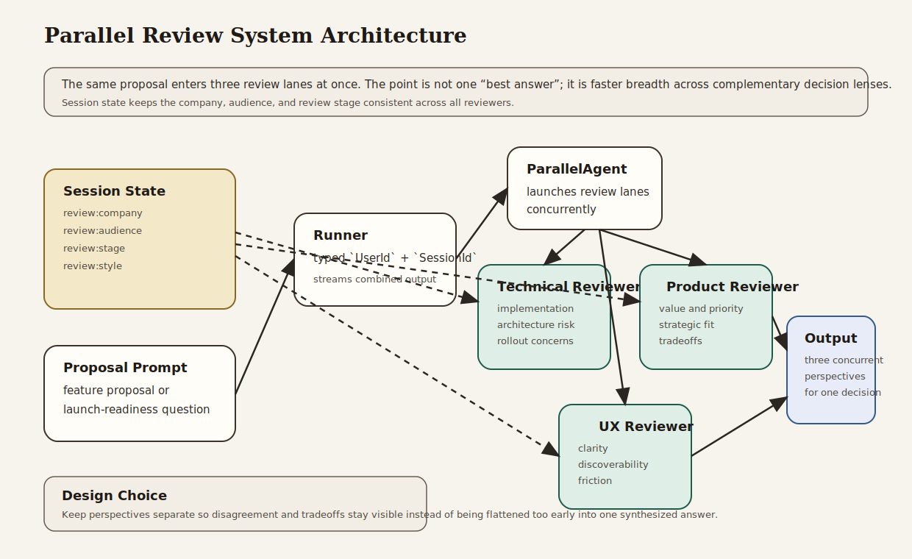

# Parallel Review System

Beginner-friendly workflow example that reviews the same proposal through technical, product, and UX perspectives concurrently.

## What This Example Teaches

- Chapter 3 concepts: explicit model, session, runner, content, and streamed responses
- Chapter 5 concepts: session-backed review context and follow-up continuity
- Chapter 7 concepts: parallel workflow orchestration for breadth-first analysis
- Chapter 16 habit: keeping decision perspectives explicit instead of burying them inside one broad prompt

## Architecture



### System Overview: How it Works

- The **session service** stores shared review context such as company, audience, stage, and style.
- The **technical reviewer** focuses on implementation, architecture, and operational risk.
- The **product reviewer** focuses on strategic fit, user value, and prioritization.
- The **UX reviewer** focuses on clarity, usability, and likely friction.
- The **parallel workflow** runs those reviews concurrently over the same proposal.
- The **runner** owns the runtime boundary: app name, root agent, session service, typed identity, and streamed output.

### Design Choices

- **Parallel review instead of one large “analyze everything” prompt**
  This keeps each review narrower and more defensible. Each specialist has one job and can go deeper inside that boundary.

- **Three explicit reviewer roles**
  Technical, product, and UX are common decision lenses in real feature reviews. The example is realistic without becoming too large.

- **Shared session-backed review profile**
  Company context, audience, and stage are stored once and reused across all reviewers and follow-up turns.

- **A follow-up prompt in the same session**
  The second example shows that the same review context can be reused when the discussion shifts from initial assessment to launch criteria.

- **No aggregation layer in the first version**
  The core lesson is concurrent perspective generation. A separate synthesizer can be added later, but it is not required to understand the workflow.

### Request Flow

1. The application creates a session with review context.
2. The caller sends a proposal.
3. The runner invokes the root `ParallelAgent`.
4. Technical, product, and UX reviewers run concurrently on the same input.
5. Their outputs are returned together in the streamed response.
6. A follow-up prompt reuses the same session and review profile.

### Why This Architecture Fits The Book

- It shows the Chapter 3 runtime model directly.
- It uses Chapter 5 session state to carry review context across turns.
- It demonstrates the Chapter 7 point that some problems benefit from concurrent perspectives rather than strict sequencing.
- It reinforces the Chapter 16 idea that decision boundaries should be explicit and inspectable.

## What the Review System Does

The example runs two related prompts:

- an initial pre-beta feature review
- a follow-up question about what should be fixed before a broader beta

The system uses the same three perspectives both times so the reader can compare how the workflow reacts to different decision questions.

## Why This Project Is Useful

This is a realistic review workflow for product and engineering teams:

- it generates breadth quickly
- it keeps specialist perspectives separated
- it shows how shared session context can anchor repeated review cycles
- it gives readers a practical use case for `ParallelAgent`

## How to Read the Code

If you are studying the implementation, read `src/main.rs` in this order:

1. `create_session`
2. the three reviewer agent definitions
3. the `ParallelAgent` construction
4. `build_runner`
5. the two example review prompts

That progression follows the book’s path from state to orchestration.

## Run It

```bash
cargo run -p parallel-review-system
```

You will need:

- `GOOGLE_API_KEY` in your environment or `.env`

The program runs:

1. an initial feature proposal review
2. a follow-up launch-readiness review in the same session

## What to Notice

- The same proposal is analyzed concurrently, not sequentially.
- Each reviewer has a narrow scope, which makes the output easier to reason about.
- Session state carries the review context without changing the workflow code.
- This is a workflow example, so the value comes from perspective separation and concurrency.
