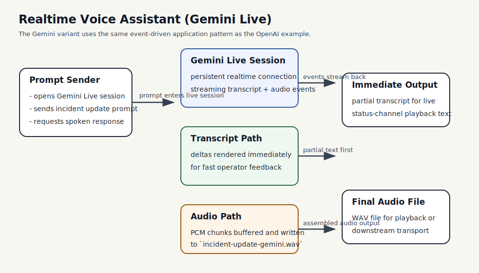

# Realtime Voice Assistant (Gemini Live)

This example is the Google-native counterpart to the OpenAI realtime voice crate. It uses Gemini Live through `adk-realtime` and demonstrates the same Chapter 12 application model: a long-lived session, incremental transcript events, separate audio events, and explicit event-loop handling in application code.

## What This Example Teaches

- Chapter 12 concepts: realtime transport, partial transcript updates, and incremental audio handling
- provider comparison: the same ADK event-driven design works across more than one realtime backend
- production habits: keep transcript rendering and audio buffering as separate concerns

## Architecture



### System Overview: How it Works

- The **Gemini Live session** keeps a persistent realtime connection open instead of issuing a one-shot text request.
- The **application event loop** reacts to incoming events as they arrive.
- The **transcript path** renders partial text immediately for low-latency operator feedback.
- The **audio path** buffers PCM audio chunks until the response completes, then writes a WAV file.

### Design Choices

- **Separate Gemini crate instead of a provider switch**
  This keeps the provider surface explicit. Readers can compare the OpenAI and Gemini variants without hiding the backend choice behind environment flags.

- **Studio key path instead of Vertex for the first example**
  The Studio path is the lighter-weight entry point for a book companion example. Vertex can be added later when the goal is infrastructure composition rather than event flow.

- **Offline-first default**
  Realtime examples depend on credentials and provider availability. The crate explains its runtime shape by default and only connects when `BOOK_RUN_LIVE_SMOKE=1` is set.

### Request Flow

1. The application creates a Gemini Live session using a Studio API key.
2. It sends one short incident-update prompt.
3. Transcript and text deltas stream back incrementally.
4. Audio deltas stream back separately and are buffered.
5. When the response completes, the buffered audio is written to a WAV file.

### Why This Architecture Fits The Book

- It reinforces the Chapter 12 point that realtime systems change the application loop.
- It shows the same architectural pattern on a second provider, which helps separate runtime design from provider-specific SDK details.
- It keeps the example close to a practical use case: spoken incident updates for operations teams.

## Run

Offline path:

```bash
cargo run -p realtime-voice-assistant-gemini
```

Live Gemini Live path:

```bash
export GOOGLE_API_KEY=your-api-key
BOOK_RUN_LIVE_SMOKE=1 cargo run -p realtime-voice-assistant-gemini
```

Current validation note:

- the crate compiles and connects to Gemini Live successfully with a Studio API key
- in this environment, the Studio-backed session completed without emitting transcript or audio chunks
- the example still teaches the correct event-loop structure, and a Vertex-backed Gemini Live setup is the stronger path for full voice validation

The live path saves the generated audio as:

```text
realtime-voice-assistant-gemini/audio-output/incident-update-gemini.wav
```
