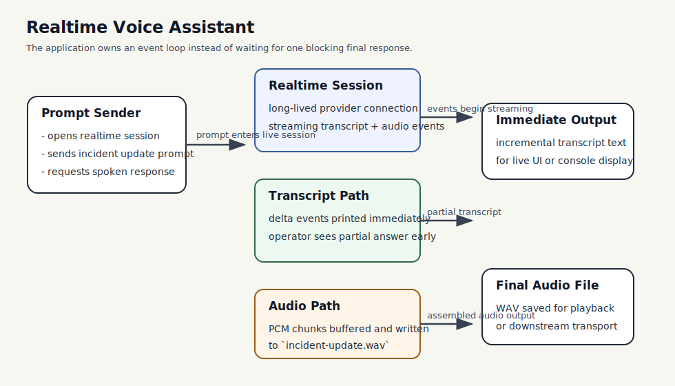

# Realtime Voice Assistant

This example focuses on the Chapter 12 shift from blocking request/response flows to event-driven realtime interaction. Instead of waiting for one final answer, the crate consumes transcript deltas and audio chunks as they arrive, then assembles the audio into a WAV file.

## What This Example Teaches

- Chapter 12 concepts: realtime transport, incremental transcript updates, and event-driven response handling
- production habits: separating transcript handling from audio handling
- interface design: applications need to react to partial events, not just final completions

## Architecture



### System Overview: How it Works

- The **realtime model session** is a long-lived connection instead of a one-shot request.
- The **application loop** listens for server events and handles transcript text and audio bytes separately.
- The **transcript path** gives immediate incremental feedback while the response is still being generated.
- The **audio path** accumulates raw PCM chunks and writes a WAV file once the response completes.

### Design Choices

- **Event-driven loop instead of a blocking helper**
  This keeps the realtime model visible. The key lesson is not just that audio is possible; it is that the application must manage partial events explicitly.

- **Transcript and audio handled independently**
  In real applications, text may be rendered immediately while audio continues buffering. Treating them as separate streams makes that model explicit.

- **Offline-first default**
  Realtime examples depend on credentials and provider limits. The crate therefore documents the runtime behavior by default and only connects when `BOOK_RUN_LIVE_SMOKE=1` is set.

### Request Flow

1. The application opens a realtime session to the provider.
2. It sends one prompt asking for a short spoken incident update.
3. Transcript deltas stream in and are printed immediately.
4. Audio deltas stream in separately and are buffered.
5. When the response completes, the buffered PCM audio is written to a WAV file.

### Why This Architecture Fits The Book

- It makes Chapter 12 concrete by showing how realtime interaction changes the application loop.
- It demonstrates that partial outputs are a first-class runtime concern.
- It keeps the example close to a real operational use case: a short incident update suitable for voice playback.

## Run

Offline path:

```bash
cargo run -p realtime-voice-assistant
```

Live realtime path:

```bash
export OPENAI_API_KEY=your-api-key
BOOK_RUN_LIVE_SMOKE=1 cargo run -p realtime-voice-assistant
```

Current `0.8.2` note:

- the crate compiles and the live path reaches OpenAI successfully
- published `adk-realtime 0.8.2` still targets the retired OpenAI Realtime beta session contract
- this example therefore exits cleanly after surfacing that upstream limitation instead of pretending the transport still works end to end

The live path saves the generated audio as:

```text
realtime-voice-assistant/audio-output/incident-update.wav
```

## Why This Example Matters

Streaming text is one step beyond blocking responses. Realtime multimodal interaction is another step again: the application now owns an event loop, partial transcript rendering, audio assembly, and connection lifecycle. This crate shows that shape directly.
