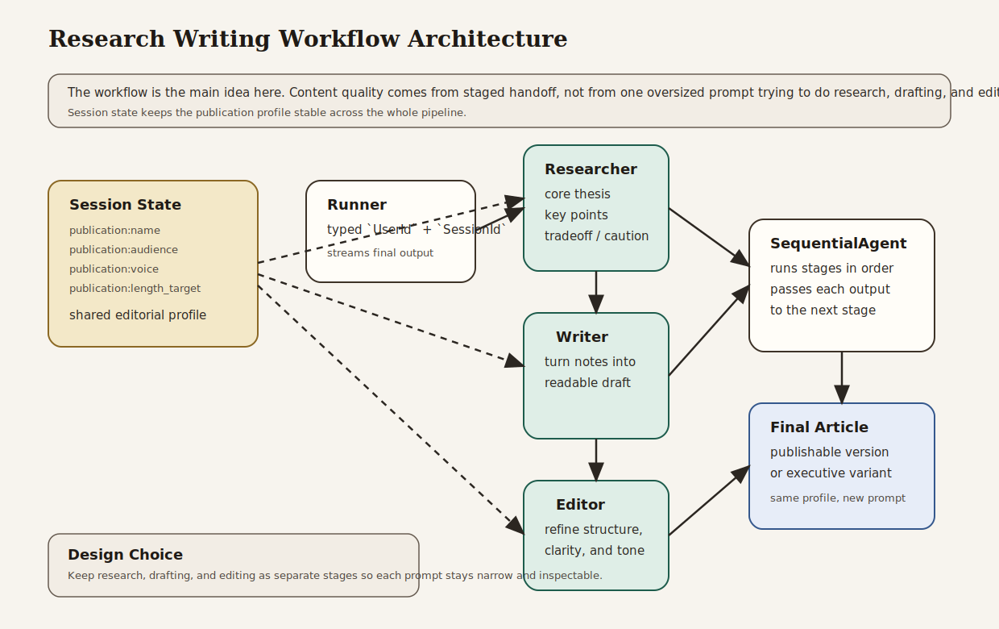

# Research Writing Workflow

Beginner-friendly workflow example that separates research, drafting, and editing into explicit stages instead of relying on one large prompt.

## What This Example Teaches

- Chapter 3 concepts: explicit model, session, runner, content, and streamed responses
- Chapter 5 concepts: session-backed publication preferences and follow-up continuity
- Chapter 7 concepts: sequential workflow orchestration with clear stage handoff
- Chapter 16 habit: keeping workflow boundaries explicit so multi-step content generation is inspectable

## Architecture



### System Overview: How it Works

- The **session service** stores publication preferences such as audience, voice, and length target.
- The **researcher** produces structured research notes and key tradeoffs.
- The **writer** turns those notes into a readable draft for the target audience.
- The **editor** refines the draft into the final publishable version.
- The **sequential workflow** ensures those stages run in order.
- The **runner** owns the runtime boundary: app name, root agent, session service, typed identity, and streamed output.

### Design Choices

- **Three explicit stages instead of one large writing prompt**
  This makes the reasoning path clearer. Research, drafting, and editing are different jobs, and the workflow reflects that.

- **Sequential workflow instead of tool calls**
  The core lesson is process orchestration, not action execution. A `SequentialAgent` is the right abstraction for that.

- **Session-backed publication profile**
  Audience, voice, and length target live in session state so the workflow remains reusable without hardcoded publication variants.

- **Follow-up prompt in the same session**
  The second run demonstrates that the workflow can produce a derivative piece while reusing the same editorial context.

- **No external retrieval in the first version**
  This example focuses on workflow shape. External search or RAG would add another dimension and make the stage design harder to isolate.

### Request Flow

1. The application creates a session with publication preferences.
2. The caller sends a writing request.
3. The runner invokes the root `SequentialAgent`.
4. The researcher produces compact notes and tradeoffs.
5. The writer turns those notes into a draft.
6. The editor returns the final cleaned version.
7. A follow-up request in the same session reuses the same editorial profile.

### Why This Architecture Fits The Book

- It shows the Chapter 3 runtime model without extra abstraction.
- It uses Chapter 5 session state to carry publication preferences through the pipeline.
- It demonstrates the Chapter 7 idea that orchestration can matter more than a single prompt.
- It reinforces the Chapter 16 principle that multi-step systems should have visible boundaries rather than hidden prompt complexity.

## What the Workflow Does

The example runs two related tasks:

- a short article on whether Rust reduces operational risk in backend services
- a shorter executive briefing on the same topic for decision-makers

Both use the same publication profile and workflow, but the second prompt shows how a derivative deliverable can reuse the same staged setup.

## Why This Project Is Useful

This is a realistic content workflow shape that maps directly to editorial or communications systems:

- it separates research from drafting
- it keeps editing as a distinct quality stage
- it shows how session-backed preferences shape the final output
- it gives readers a concrete example of workflow-oriented agent design

## How to Read the Code

If you are studying the implementation, read `src/main.rs` in this order:

1. `create_session`
2. the `researcher`, `writer`, and `editor` agent definitions
3. the `SequentialAgent` construction
4. `build_runner`
5. the two example turns

That progression follows the book’s path from state to staged orchestration.

## Run It

```bash
cargo run -p research-writing-workflow
```

You will need:

- `GOOGLE_API_KEY` in your environment or `.env`

The program runs:

1. a main article request
2. a follow-up executive briefing request in the same session

## What to Notice

- The workflow boundary is explicit in code: research, draft, edit.
- The second request reuses the same publication profile without rebuilding the agent graph.
- Session state shapes the voice and audience across the whole pipeline.
- This is a workflow example, not a retrieval example, so the value is in the stage design itself.
