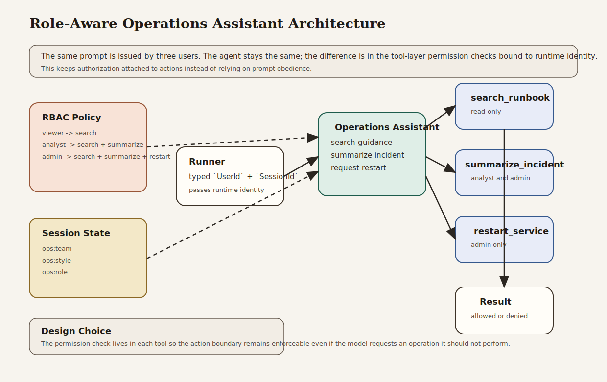

# Role-Aware Operations Assistant

Beginner-friendly operations example that enforces role-based permissions at tool execution time.

## What This Example Teaches

- Chapter 16 concepts: RBAC, explicit runtime authorization, and denied operations
- Chapter 6 concepts: tools as concrete operational boundaries
- Chapter 3 concepts: explicit runner, session, and streamed response flow
- Chapter 5 concepts: session-backed role context applied to a single reusable assistant

## Architecture



### System Overview: How it Works

- The **access control layer** defines roles and the tool permissions each role has.
- The **session service** stores role-aware assistant context such as team and response style.
- The **operations assistant** exposes three tools: search, summarize, and restart.
- Each **`FunctionTool`** checks the caller’s runtime identity through `ctx.user_id()`.
- The **runner** owns the runtime boundary: app name, root agent, session service, typed identity, and streamed output.

### Design Choices

- **Runtime permission checks inside tools**
  This keeps the authorization boundary attached to the action itself. The model can request an action, but the tool decides whether the caller is allowed to execute it.

- **Three roles with the same prompt**
  Viewer, analyst, and admin all ask for the same workflow. The difference comes from permissions, not from separate prompts or separate code paths.

- **Search, summarize, and restart as a permission ladder**
  These three operations make the boundary easy to understand: read-only search, higher-value summarization, and high-risk mutation.

- **Session-backed role context**
  The assistant can explain denials in role-aware language, but the real enforcement still happens inside the tools.

- **No fake success on denied actions**
  The assistant is instructed to surface denial clearly. This matters because hidden failures are operationally dangerous.

### Request Flow

1. The application builds an RBAC policy with assigned roles.
2. A user session is created with role-aware assistant context.
3. The caller sends an operations request.
4. The assistant decides which tools to invoke.
5. Each tool reads `ctx.user_id()` and checks the caller’s permission.
6. Allowed actions succeed; denied actions return explicit denial results.
7. The assistant explains the final outcome to the caller.

### Why This Architecture Fits The Book

- It carries more of Chapter 16 directly into runnable code.
- It uses Chapter 6 tools as concrete action boundaries instead of treating permissions as prompt text.
- It keeps the Chapter 3 runtime model visible.
- It shows that session context can improve explanations while tool-layer enforcement preserves the real safety boundary.

## What the Assistant Does

The example runs the same request for three users:

- `viewer`: can search only
- `analyst`: can search and summarize
- `admin`: can search, summarize, and restart a service

Each user asks for runbook search, summarization, and a service restart. The result changes because the permission boundary is real.

## Why This Project Is Useful

This is a realistic operations-assistant pattern:

- it keeps read and write actions separate
- it shows that permissions must be checked where actions happen
- it demonstrates how the same assistant can serve multiple roles safely
- it gives readers a concrete Chapter 16 example beyond policy prose

## How to Read the Code

If you are studying the implementation, read `src/main.rs` in this order:

1. `build_access_control`
2. the three `FunctionTool` definitions
3. `create_session`
4. the assistant instruction
5. the three user runs

That progression follows the book’s path from authorization policy to runtime behavior.

## Run It

```bash
cargo run -p role-aware-operations-assistant
```

You will need:

- `GOOGLE_API_KEY` in your environment or `.env`

The program runs the same operations prompt through three user roles so you can compare allowed and denied outcomes directly.

## What to Notice

- The tool checks use runtime identity, not a hardcoded “current user” prompt assumption.
- The assistant remains one reusable agent; the permission boundary lives in the tool layer.
- Denied actions are explicit and visible in the final result.
- This example carries more of Chapters 6 and 16 than the earlier content-oriented examples.
