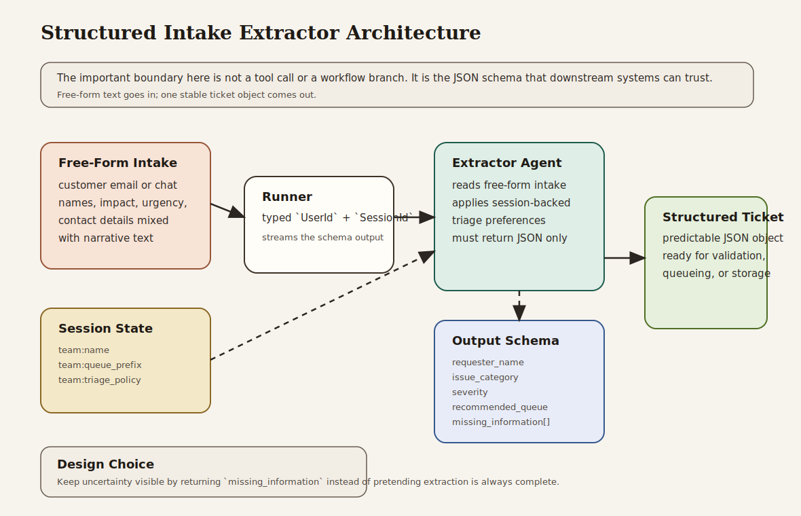

# Structured Intake Extractor

Beginner-friendly structured output example that turns free-form support requests into schema-shaped intake tickets for downstream systems.

## What This Example Teaches

- Chapter 3 concepts: explicit model, session, runner, content, and streamed responses
- Chapter 4 concepts: schema-shaped output and predictable JSON contracts
- Chapter 5 concepts: session-backed operational preferences inside the agent instruction
- Chapter 16 habit: keeping downstream integration boundaries explicit and validation-friendly

## Architecture



### System Overview: How it Works

- The **session service** stores triage preferences such as queue prefix and escalation policy.
- The **extractor agent** receives unstructured intake text and is constrained by an output schema.
- The **runner** owns the runtime boundary: app name, root agent, session service, typed identity, and streamed output.
- The **schema contract** makes the response predictable for ticketing systems, databases, or validation pipelines.
- The **application layer** parses the returned JSON, enforces queue-naming conventions, and pretty-prints the stable structure.

### Design Choices

- **Schema-first extraction instead of prose summarization**
  The main lesson is that downstream systems need reliable fields, not only good natural-language answers.

- **One extractor agent instead of multiple intake-specific agents**
  The example stays focused on structured output. Routing or specialist delegation would distract from the main contract.

- **Session-backed triage policy instead of hardcoded queue logic**
  The queue prefix and escalation posture live in session state so the example still demonstrates templated instruction design.

- **A small normalization step after extraction**
  Real systems often validate or normalize model output before sending it to downstream services. This example enforces queue naming after schema validation.

- **Missing-information tracking inside the schema**
  Real intake workflows often receive incomplete data. Returning a `missing_information` array is more useful than pretending the record is complete.

- **Tool-free first version**
  Tools are unnecessary here. The important boundary is the JSON schema itself.

### Request Flow

1. The application creates a session with triage preferences.
2. The caller sends a free-form intake message.
3. The runner invokes the extractor agent with that session context.
4. The extractor responds with JSON constrained by the schema.
5. The application parses the JSON, normalizes queue naming, and can then pass it to downstream systems.

### Why This Architecture Fits The Book

- It shows the Chapter 3 runtime model directly.
- It turns Chapter 4 structured output into a real intake-processing use case.
- It uses Chapter 5 session state to influence behavior without changing the code path.
- It reinforces the Chapter 16 principle that integration boundaries should be explicit and machine-friendly.

## What the Extractor Does

The example processes two intake messages:

- a payment incident with clear contact and impact information
- an access request with missing details that must be surfaced explicitly

For each message, the extractor returns one JSON object with normalized fields such as category, severity, queue, and missing information.

## Why This Project Is Useful

This is the smallest realistic structured-output example in the companion repo:

- it accepts messy natural language
- it produces stable machine-readable output
- it exposes missing information instead of hiding uncertainty
- it shows how schema-constrained output fits into an actual operational workflow

## How to Read the Code

If you are studying the implementation, read `src/main.rs` in this order:

1. `intake_ticket_schema`
2. `create_session`
3. the extractor instruction
4. `extract_and_print`
5. the two example intake runs

That progression follows the book’s path from schema design to runtime execution.

## Run It

```bash
cargo run -p structured-intake-extractor
```

You will need:

- `GOOGLE_API_KEY` in your environment or `.env`

The program runs two extraction examples and prints the resulting JSON objects.

## What to Notice

- The agent does not answer in prose. It produces one machine-friendly object.
- Missing fields are surfaced explicitly in `missing_information`.
- Session state changes the triage policy without requiring a different agent definition.
- The output is suitable for validation or ingestion into a support system.
- The application layer still enforces queue naming, which mirrors how many production systems treat model output.
