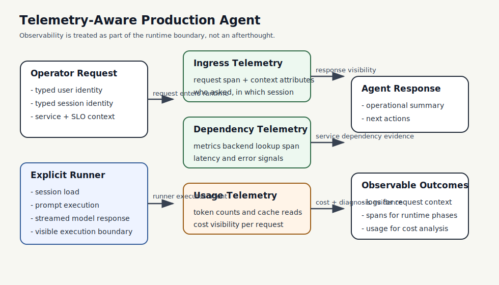

# Telemetry-Aware Production Agent

This example turns the Chapter 15 observability material into a real operations-facing service. The crate shows how to instrument an ADK-Rust agent so operators can see request context, dependency activity, model usage, and decision signals without guessing where time or cost was spent.

## What This Example Teaches

- Chapter 3 concepts: explicit runner construction and streamed execution
- Chapter 5 concepts: session-backed operational context
- Chapter 15 concepts: structured logs, spans, usage recording, and observability boundaries
- production habits: separating request telemetry, dependency telemetry, and model telemetry

## Architecture



### System Overview: How it Works

- The **agent** answers operator questions about a production service in a concise operational style.
- The **session state** stores durable context such as the target service, the preferred response style, and the service-level objective.
- The **telemetry layer** records request ingress, dependency lookups, usage metrics, and final decision attributes as separate signals.
- The **runner** stays explicit so the execution boundary remains visible: typed user identity, typed session identity, streamed response handling, and model invocation all happen in one inspectable path.

### Design Choices

- **Separate spans by concern**
  Request ingress, downstream metric queries, and model usage are instrumented separately. That is the minimum structure needed to explain latency and cost in a production system.

- **Manual usage recording in the offline path**
  The example records a synthetic usage sample so the observability pattern can be demonstrated without depending on a live provider run.

- **Session-backed operations context**
  The agent is not a generic assistant. It inherits stable context about the service and SLO from session state, which is closer to how operator tooling behaves in practice.

- **Explicit runner path instead of launcher-only wiring**
  The goal of this example is to keep the runtime boundary inspectable. Telemetry is more useful when engineers can see exactly where the execution path begins and ends.

### Request Flow

1. An operator request arrives and an ingress span records the typed user and session context.
2. A dependency span records simulated metrics lookups that would normally hit monitoring backends.
3. A usage span records model-related token accounting.
4. A decision span records the operational recommendation that results from the observed signals.
5. In live mode, the same crate sends a real prompt through the ADK runner and streams the answer back.

### Why This Architecture Fits The Book

- It keeps the Chapter 3 runner model visible instead of hiding execution behind wrappers.
- It reinforces the Chapter 5 idea that session state carries stable context for repeated interactions.
- It makes Chapter 15 concrete by turning observability from a side topic into part of the agent design.

## Run

Offline telemetry path:

```bash
cargo run -p telemetry-aware-production-agent
```

Live runner-backed path:

```bash
export GOOGLE_API_KEY=your-api-key
BOOK_RUN_LIVE_SMOKE=1 cargo run -p telemetry-aware-production-agent
```

## Why This Example Matters

Most agent demos stop at “the model answered.” Production systems need a fuller story: what request was processed, which dependency was consulted, how much usage was consumed, and what operational conclusion was produced. This crate shows that observability is part of the runtime design, not a bolt-on afterthought.
